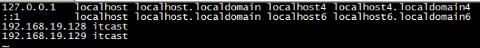
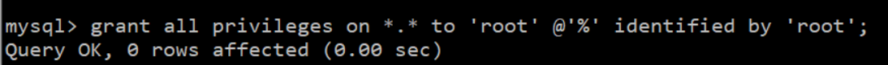

#                                        Linux基础

## 一、 Linux的目录结构：

 

 

在Linux中  /  的意思就是根目录。

root管理员的home目录root

其他用户的home目录home目录中

 

## **二、** Linux的常用命令

### **1．** 切换目录命令cd：

- cd app	切换到app目录
- cd ..	切换到上一层目录
- cd /		切换到系统根目录
- cd ~		切换到用户主目录
- cd -		切换到上一个所在目录

使用tab键来补全文件路径

### **2．** 列出文件列表：ls 

ls(list)是一个非常有用的命令，用来显示当前目录下的内容。配合参数的使用，能以不同的方式显示目录内容。 

 格式：ls[参数] [路径或文件名]

常用：

在linux中以 . 开头的文件都是隐藏的文件

-  ls
-  ls -a  显示所有文件或目录（包含隐藏的文件）
-  ls -l  缩写成ll   （可以将非隐藏的文件夹和文件夹的所有信息显示出来）

### **3．** 创建目录和移除目录：mkdir ，rmdir

mkdir(make directory)命令可用来创建子目录。

mkdir app   在当前目录下创建app目录mkdir –p app2/test   级联创建aap2以及test目录

rmdir(remove directory)命令可用来删除“空”的子目录：rmdir app  è 删除app目录

### **4．** 浏览文件

```
cat用于显示文件的内容。格式：cat[参数]<文件名>
  *cat yum.conf
more一般用于要显示的内容会超过一个画面长度的情况。
        按空格键显示下一个画面。
        回车显示下一行内容。
        按 q 键退出查看。

* more yum.conf
   * 空格显示下一页数据 回车显示下一行的数据

less用法和more类似，不同的是less可以通过上下键来控制。
  * less yum.conf
   * PgUp 和 PgDn 进行上下翻页.
```

```
【tail】
   tail命令是在实际使用过程中使用非常多的一个命令，它的功能是：用于显示文件后几行的内容。
用法:
tail -10 /etc/passwd   查看后10行数据
tail -f catalina.log   动态查看日志(*****)
```

### **5．** 文件操作：

**【rm】**

```
rm  删除文件
用法：rm [选项]... 文件...
rm a.txt   删除a.txt文件
删除需要用户确认，y/nrm 删除不询问
rm -f a.txt   不询问，直接删除rm 删除目录
rm -r a   递归删除不询问递归删除（慎用）
rm -rf  a   不询问递归删除
rm -rf *    删除所有文件
rm -rf /*   自杀
```

**【cp、mv】**

```
cp(copy)命令可以将文件从一处复制到另一处。一般在使用cp命令时将一个文件复制成另一个文件或复制到某目录时，需要指定源文件名与目标文件名或目录。
cp a.txt b.txt   将a.txt复制为b.txt文件
cp a.txt ../   将a.txt文件复制到上一层目录中
mv 移动或者重命名
mv a.txt ../   将a.txt文件移动到上一层目录中
mv a.txt b.txt   将a.txt文件重命名为b.txt
```

【tar】命令:(打包或解压)

```
    tar命令位于/bin目录下，它能够将用户所指定的文件或目录打包成一个文件，但不做压缩。一般Linux上常用的压缩方式是选用tar将许多文件打包成一个文件，再以gzip压缩命令压缩成xxx.tar.gz(或称为xxx.tgz)的文件。常用参数：
       -c：创建一个新tar文件
       -v：显示运行过程的信息
       -f：指定文件名
       -z：调用gzip压缩命令进行压缩
       -t：查看压缩文件的内容
       -x：解开tar文件
打包：
   -tar –cvf xxx.tar ./*
打包并且压缩：
   tar –zcvf xxx.tar.gz ./* 
解压 
   tar –xvf xxx.tar
   t0ar -zxvf xxx.tar.gz -C /usr/aaa      这个-C是为了将我们的压缩文件解压到自定义的文件夹下
```

**【find】命令**

```
find指令用于查找符合条件的文件
示例：
find / -name “ins*” 查找文件名称是以ins开头的文件
find / -name “ins*” –ls 
find / –user itcast –ls 查找用户itcast的文件
find / –user itcast –type d –ls 查找用户itcast的目录
find /-perm -777 –type d-ls 查找权限是777的文件
```

**【grep】命令**

```
查找文件里符合条件的字符串。
用法: grep [选项]... PATTERN [FILE]...示例：
grep lang anaconda-ks.cfg  在文件中查找lang
grep lang anaconda-ks.cfg –color 高亮显示
```

 

 

 

 

### **6．** 其他常用命令

pwd：显示当前所在目录

touch：创建一个空文件       touch a.txt

clear或者crtl + L：清屏

## **三、** Vi和Vim编辑器

#### **1．** Vim编辑器：

```
在Linux下一般使用vi编辑器来编辑文件。vi既可以查看文件也可以编辑文件。三种模式：命令行、插入、底行模式。
 切换到命令行模式：按Esc键；
  切换到插入模式：按 i 、o、a键；
   i 在当前位置前插入
   I 在当前行首插入
   a 在当前位置后插入
   A 在当前行尾插入
   o 在当前行之后插入一行
   O 在当前行之前插入一行
切换到底行模式：按 :（冒号）；更多详细用法，查询文档《Vim命令合集.docx》和《vi使用方法详细介绍.docx》
打开文件：vim file
退出：esc  :q
修改文件：输入i进入插入模式
保存并退出：esc:wq
不保存退出：esc:q！
三种进入插入模式：
i:在当前的光标所在处插入
o:在当前光标所在的行的下一行插入
a:在光标所在的下一个字符插入
快捷键：
dd – 快速删除一行
yy - 复制当前行
nyy - 从当前行向后复制几行
p - 粘贴
R – 替换
打开文件：vim file
退出：esc  :q
修改文件：输入i进入插入模式
保存并退出：esc:wq
不保存退出：esc:q！
三种进入插入模式：
   i:在当前的光标所在处插入
   o:在当前光标所在的行的下一行插入
   a:在光标所在的下一个字符插入
快捷键：
   dd – 快速删除一行
   yy - 复制当前行
   nyy - 从当前行向后复制几行
   p - 粘贴
   R – 替换
```

#### **2．** 重定向输出>和>>

```
>  重定向输出，覆盖原有内容；>> 重定向输出，又追加功能；示例：
cat /etc/passwd > a.txt  将输出定向到a.txt中
cat /etc/passwd >> a.txt  输出并且追加
ifconfig > ifconfig.txt
```

#### **3．** 系统管理命令

```
ps 正在运行的某个进程的状态
ps –ef  查看所有进程
ps –ef | grep ssh 查找某一进程
kill 2868  杀掉2868编号的进程
kill -9 2868  强制杀死进程
```

#### **4．** 管道|

管道是Linux命令中重要的一个概念，其作用是将一个命令的输出用作另一个命令的输入。示例

```
ls --help | more  分页查询帮助信息
ps –ef | grep java  查询名称中包含java的进程
ifconfig | more
cat index.html | more
ps –ef | grep aio
```

## 四、Linux的权限命令

#### **1．** 文件权限（分为四组）

 


r:对文件是指可读取内容 对目录是可以ls

w:对文件是指可修改文件内容，对目录是指可以在其中创建或删除子节点(目录或文件)

x:对文件是指是否可以运行这个文件，对目录是指是否可以cd进入这个目录

d:表示文件夹

l:表示连接

#### **2．** Linux三种文件类型：

普通文件： 包括文本文件、数据文件、可执行的二进制程序文件等。 

目录文件： Linux系统把目录看成是一种特殊的文件，利用它构成文件系统的树型结构。 

设备文件： Linux系统把每一个设备都看成是一个文件

#### **3．** 文件类型标识

普通文件（-）目录（d）符号链接（l）

 进入etc可以查看，相当于快捷方式字符设备文件（c）块设备文件（s）套接字（s）命名管道（p）

#### **4．** 文件权限管理：

chmod 变更文件或目录的权限。

chmod 755 a.txt    注意：这里的755中的每一位数字都代表了对每一组的权限。

chmod u=rwx,g=rx,o=rx a.txt

## **五、** Linux上常用网络操作

## **1．** 主机名配置

hostname 查看主机名

hostname xxx 修改主机名 重启后无效

如果想要永久生效，可以修改/etc/sysconfig/network文件

## **2．** IP地址配置

```
ifconfig 查看(修改)ip地址(重启后无效)
ifconfig eth0 192.168.12.22 修改ip地址
如果想要永久生效
修改 **/etc/sysconfig/network-scripts/ifcfg-eth0**文件
DEVICE=eth0 #网卡名称
BOOTPROTO=static #获取ip的方式(static/dhcp/bootp/none)
HWADDR=00:0C:29:B5:B2:69 #MAC地址
IPADDR=12.168.177.129 #IP地址
NETMASK=255.255.255.0 #子网掩码
NETWORK=192.168.177.0 #网络地址
BROADCAST=192.168.0.255 #广播地址
NBOOT=yes # 系统启动时是否设置此网络接口，设置为yes时，系统启动时激活此设备。
```

## **3．** **域名映射**

**/etc/hosts**文件用于在通过主机名进行访问时做ip地址解析之用,相当于windows系统的**C:\Windows\System32\drivers\etc\hosts**文件的功能

 

## **4．** 网络服务管理

```
service network status 查看指定服务的状态
service network stop 停止指定服务
service network start 启动指定服务
service network restart 重启指定服务

service --status–all 查看系统中所有后台服务
netstat –nltp 查看系统中网络进程的端口监听情况

防火墙设置
防火墙根据配置文件/etc/sysconfig/iptables来控制本机的”出”、”入”网络访问行为。
service iptables status 查看防火墙状态
service iptables stop 关闭防火墙
service iptables start 启动防火墙
chkconfig  iptables off 禁止防火墙自启
```

有的时候你上网安装软件可能不能顺利进行，可能就是防火墙的问题。

## **六、** Linux上软件安装

- lLinux上的软件安装有以下几种常见方式介绍


1. 二进制发布包

软件已经针对具体平台编译打包发布，只要解压，修改配置即可

2. RPM包

软件已经按照redhat的包管理工具规范RPM进行打包发布，需要获取到相应的软件RPM发布包，然后用RPM命令进行安装

**注意：**但是这种安装有一定的缺陷就是 如果你安装的包C依赖于包A和包B，你使用这个该方法直接打包C，它只会给你打包C而A和B不会，所以你要先打包A和B，然后再打包C。

3. Yum在线安装

软件已经以RPM规范打包，但发布在了网络上的一些服务器上，可用yum在线安装服务器上的rpm软件，并且会自动解决软件安装过程中的库依赖问题

**注意：**这种方式则和RPM打包相反，你打包C也会把A和B一起打包了，但是需要网络的支撑。

4. 源码编译安装

软件以源码工程的形式发布，需要获取到源码工程后用相应开发工具进行编译打包部署。

- 上传与下载工具


1. FileZilla

 

 

2. lrzsz

我们可以使用yum安装方式安装 yum install lrzsz

注意：必须有网络

可以在crt中设置上传与下载目录

 

上传：

 

下载

 

3. sftp

使用alt + p 组合键打开sftp窗口

 

使用put 命令上传

 

使用get命令下载

 

默认下载位置在当前计算的的文档位置

 

 

## **1．** 在Linux上安装JDK:

【步骤一】：上传JDK到Linux的服务器.

java –version

 查看安装的jdk信息

rpm -qa | grep java

 卸载jdk

rpm -e --nodeps java-1.6.0-openjdk-1.6.0.35-1.13.7.1.el6_6.i686

rpm -e --nodeps java-1.7.0-openjdk-1.7.0.79-2.5.5.4.el6.i686

如果你的虚拟机上面没有JDK，那么就不用卸载了。

【步骤二】：在Linux服务器上安装JDK.

使用sftp将jdk的安装包put到系统目录上。

 通常将软件安装到/usr/local

命令：cd /usr/local

命令：mkdir jdk (创建jdk目录)

在系统目录下使用 mv  jdk包名  /usr/lcoal/jdk/(剪切过去)

 直接解压就可以

  tar –zxvf  jdk.tar.gz  -C 目标路径  

【步骤三】：配置JDK的环境变量.

配置环境变量：

① vi /etc/profile

② 在末尾行添加

```
	#set java environment
	JAVA_HOME=/usr/local/jdk/jdk1.7.0_71
	CLASSPATH=.:$JAVA_HOME/lib.tools.jar
	PATH=$JAVA_HOME/bin:$PATH
	export JAVA_HOME CLASSPATH PATH
```

保存退出

**注意：这里的JAVA_HOME后面的路径要和你安装JDK的路径保持一致**

③source /etc/profile  使更改的配置立即生效

判断是否成功，你可以通过java -version来查看你的JDK版本


这样就成功了

## **2．** 在Linux上安装Mysql:

我这里设置的数据库密码是root

这里我的Linux的主机地址是：192.168.37.128

使用和JDK相同的方法将其解压，只不过你的命令应该是  tar –xvf  mysql.tar  -C 目标路径 

将系统自带的mysql卸载

rpm –qa | grep mysql 

 

 

【步骤二】：安装MYSQL服务端

 

下面的提示是告诉我们root用户的密码第一次是随机生成的，它保存在/root/.mysql_secret中，第一次登录需要修改root密码

 

【步骤三】：安装MYSQL客户端

 

查看生成的root密码

使用cat  /root/.mysql_secret

  

需要开启mysql服务

 

然后使用 mysql -uroot -p密码     登录数据库


执行下面操作报错，原因是第一次操作mysql必须修改root用户的密码

 

设置root用户的密码

 

关于mysql远程访问设置

grant all privileges on *.* to 'root' @'%' identified by 'root';



flush privileges;（刷新一下）

 

在linux中很多软件的端口都被”防火墙”限止，我们需要将防火墙关闭

service iptables stop


## **3．** 在Linux上安装tomcat:

1.Tomcat上传到linux上

2.将上传的tomcat解压

命令：tar -zxvf  包名

3.在tomcat/bin目录下执行 startup.sh（注意防火墙）


4.在浏览器使用我的IP和端口号访问.

192.168.37.129:8080


**注意：**这样就成功了，但是可能会报错，可能是因为Linux防火墙的问题。

使用：service iptables stop    命令来关闭防火墙，这样就对了。

## **4．** 在Linux上安装redis

【步骤一】安装gcc-c++

redis是C语言开发，安装redis需要先将官网下载的源码进行编译，编译依赖gcc环境。

输入命令:  yum install gcc-c++

​	输入y确认下载

 

输入y确认安装

安装 gcc 成功！

我这里使用的centos6自己带了gcc

【步骤二】安装redis

在/usr/local目录下：

1. 下载redis

命令：wget   http://download.redis.io/releases/redis-3.0.4.tar.gz

2. 解压

​    tar -zxvf redis-3.0.4.tar.gz

3. 编译安装

切换至程序目录:cd redis-3.0.4。

执行make命令编译：make。

执行安装命令:make PREFIX=/usr/local/redis install  （这里通过PREFIX指定了下载安装到哪儿）。


make install安装完成后，会在/usr/local/bin目录下生成下面几个可执行文件，它们的作用分别是：


redis-server：Redis服务器端启动程序

redis-cli：Redis客户端操作工具。也可以用telnet根据其纯文本协议来操作

redis-benchmark：Redis性能测试工具

redis-check-aof：数据修复工具

redis-check-dump：检查导出工具

【步骤三】配置redis

1. 复制配置文件到/usr/local/redis/bin目录：

   cd redis-3.0.4

   

cp redis.conf /usr/local/redis/bin/


【步骤四】启动redis

1. 进入redis/bin目录

​      cd redis/bin

启动redis服务端

./redis-server redis.conf


2. 克隆新窗口，启动redis客户端

​       ./redis-cli

 

## **5．** 部署项目到Linux

未完........

 