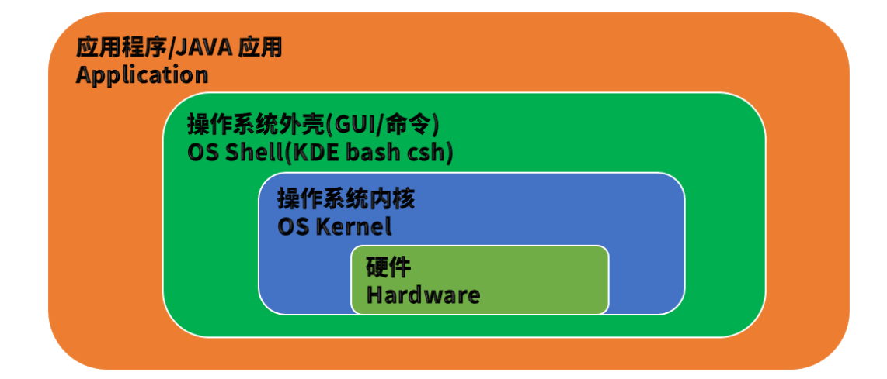
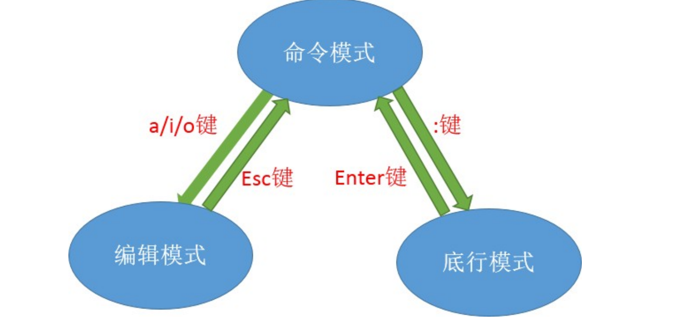

# Linux系统概述和编程基础


# **6.1** **Linux**系统概述（常识）


## **6.1.1** **计算机的体系结构**

计算机由计算机硬件和计算机软件两个部分组成，其中计算机软件(Computer   Software)可分为系统软件和应用软件，系统软件就是操作系统，是其他软件的基础。



目前主流的操作系统有：Windows系列、Unix系列、Linux系列、Android系列、IOS系列、...

## **6.1.2** **Linux**系统的概述

Linux系统诞生于1991年，在林纳斯·托瓦兹（Linus Torvalds）上大学期间因不满意教学中使用的MINIX操作系统并出于个人爱好设计和研发的。

Linux系统是一套免费、自由、开发源代码的类Unix操作系统，是一个基于Posix(Portable Operating System Interface)标准和多用户、多任务、支持多线程的操作系统。

Linux能运行主要的Unix工具软件、应用程序和网络协议，支持32位和64位硬件。

## ****6.1.3主要发行版本


Redhat：目前最大的Linux发行商，功能全面并且稳定，于2018年10月被IBM以340亿美元的价格  收购。

Ubuntu：目前最好的Linux桌面版，拥有很人性化的亮丽的交互界面，强大的软件源支持。CentOS：是RHEL的克隆版本，可以认为是免费版本的Redhat系统。

 

# **6.2** **CentOS**系统安装（掌握）

## **6.2.1** **Vmware**的下载和安装

下载地址：[https://www.vmware.com/cn.html ](https://www.vmware.com/cn.html)按照安装教程一步步操作即可。

## **6.2.2** **CentOS**系统的下载和安装

下载地址：<https://www.centos.org/>

按照安装教程通过Vmware软件进行CentOS系统的安装。。

# **6.3** **目录结构（熟悉）**

## **6.3.1** **框架结构**


## **6.3.2** **目录详解**

| **目录名称** | **功能介绍**                                                 |
| ------------ | ------------------------------------------------------------ |
| /bin         | binarie:存放二进制可执行文件 (例如tomcat的bin目录)           |
| /sbin        | super binaries:存放二进制文件,只有root用户才能访问           |
| /boot        | 系统启动核心目录,存放系统启动程序文件，例:查看启动文件的大小 |
| /dev         | devices:用于存放硬件设备文件                                 |
| /etc         | etcetera:存放系统配置文件(字体文件等)                        |
| /home        | 家目录,每一个用户都有一个”家”，用户的起始目录,创建用户跟随创建相应的家目录 |
| /lib         | library:系统资源文件类库                                     |
| /proc        | 内存映射目录,可以查看系统相关硬件的信息                      |
| /var         | variable:可变的,变量. 部署项目用的                           |
| /tmp         | temporary:用来存放临时文件                                   |
| /root        | 超级用户root的家目录                                         |
| /usr         | unix shared resouce: 存放unix共享系统资源，类似于” C:/ Program Files”,用于安装各种软件 |

# **6.4** **常用命令（重点）**

## **6.4.1** **Shell**的概念

Shell俗称外壳，是提供用户使用界面的一种软件，叫做命令解释器。

主要负责接受用户输入的命令，然后调用相应的应用程序，最后向用户输出程序运行的结果。

## **6.4.2** **命令的格式**

命令 [-选项] [参数]

命令区分大小写，其中选项和参数是可选的，中间采用空格隔开。

## **6.4.3** **常用命令的详解**

### **（1）** **查看目录下文件**/****目录

 ls 可以获取当前目录下的所有内容

| **命令**    | **功能描述**                        |
| ----------- | ----------------------------------- |
| ls          | list显示文件（系统文件）            |
| ls -l 或 ll | list -list显示详细信息              |
| ls -a       | list -all显示全部(包含隐藏文件)文件 |
| ls -al      | list -all list 上两个合体           |
| ls 目录名   | 查看目录下有什么东西                |

### **（2）** **目录切换**

| **命令**      | **功能描述**         |
| ------------- | -------------------- |
| cd（空格） .. | 上一级目录           |
| cd dirname    | 进入目录             |
| cd 或 cd ~    | 直接回到用户的家目录 |
| cd /          | 回到系统根目录       |

相对路径：是以当前目录为开头的路径信息

绝对路径：以根目录为开头的路径信息

### **（3）** **查看完整路径**

| **命令** | **功能描述**           |
| -------- | ---------------------- |
| pwd      | 查看当前目录所在的位置 |

### **（4）** **查看当前用户**

| **命令** | **功能描述**       |
| -------- | ------------------ |
| whoami   | 查看当前用户的名称 |

### **（5）** **用户切换**

| **命令**  | **功能描述**           |
| --------- | ---------------------- |
| su        | 普通用户切换到root用户 |
| su root   | 切换到root用户         |
| su 用户名 | 切换到普通用户         |
| exit      | 退回到原来用户         |

最好使用su和exit搭配使用，否则多次使用su指令会导致用户的**”叠加”。**

### **（6）** **管理用户**

 

| **命令**    | **功能描述**         |
| ----------- | -------------------- |
| useradd xxx | 创建用户             |
| passwd xxx  | 为创建的用户设置密码 |
| userdel     | 删除用户             |

### **（7）** **查看命令的所在目录**

| **命令**   | **功能描述**               |
| ---------- | -------------------------- |
| which 命令 | 查看指定命令所在的路径信息 |

### **（8）** **文件操作**

 cat一次性把全部内容拿出来，more是把一部分内容拿出来

| **命令**             | **功能描述**                             |
| -------------------- | ---------------------------------------- |
| touch fileName        | 创建名字为fileName的文件                  |
| touch dir/fileName    | 在dir目录下创建名字为fileName的文件       |
| echo 内容 > fileName  | 把内容覆盖写到文件中，若文件不存在则创建 |
| echo 内容 >> fileName | 把内容追加到文件中                       |
| cat fileName          | 打印文件内容到终端                       |
| more fileName         | 分屏查看文件各行内容，不支持回看         |
| less fileName         | 查看文件各部分内容，支持回看             |
| head -n fileName      | 查看文件的前n行内容                      |
| tail -n fileName      | 查看文件末尾n行内容                      |
| wc fileName           | 查看文件的行数                           |

### **（9）** **目录操作**

| **命令**                | **功能描述**                                 |
| ----------------------- | -------------------------------------------- |
| mkdir 目录名            | 创建普通文件夹                               |
| mkdir -p 目录/目录/目录 | 递归方式创建多级父子文件夹                   |
| mv dir1 dir2            | 将dir1移动到dir2中                           |
| mv dir1/dir2 ./         | 将dir1中dir2移动到当前目录下                 |
| mv dir1 name            | 将dir1改名为name                             |
| cp dir1 name            | 将dir1拷贝为name                             |
| cp -r dir1 dir2         | 需要设置参数 -r (recursive递归) 无视目录层次 |
| rm 文件                 | 删除文件                                     |
| rm -r 目录              | 递归删除目录(无视目录层次)                   |
| rm -rf 文件/目录        | -r force(强制) 删除文件/目录                 |

### **（10）** **查找操作**

| **命令**                     | **功能描述**               |
| ---------------------------- | -------------------------- |
| find / -name passwd[完整名称] | 查找passwd文件             |
| find ./ -name “p*”            | 查找带”p”的文件            |
| find ./ -type f               | 查找所有文件               |
| grep 内容 fileName            | 从指定文件中查找指定的内容 |

### **（11）** **权限管理**

| **命令**               | **功能描述**                                |
| ---------------------- | ------------------------------------------- |
| chmod 权限 文件/目录名 | 管理指定文件的权限信息，r读:4 w写:2 x执行:1 |

### **（12）** **进程管理**

| **命令**       | **功能描述**             |
| -------------- | ------------------------ |
| ps             | 查看当前终端窗口里的进程 |
| ps -aux        | 查看系统中的所有进程     |
| ps -ef         | 查看进程列表             |
| kill 进程号    | 杀死指定的进程           |
| kill -9 进程号 | 强制杀死指定的进程       |

### **（13）** **其它命令**

| **命令**                                   | **功能描述**               |
| ------------------------------------------ | -------------------------- |
| ifconfig                                    | 查看当前系统的IP地址等信息 |
| tar zcvf 压缩文件名.tar.gz 路径1 路径2 ... | 实现一组文件或文件夹的打包 |
| tar zxvf 压缩文件名.tar.gz                 | 实现解压缩解包             |
| man [章节号] 命令/函数名                   | 查询指定的命令或函数       |

 

# **6.5** **vi**工具的使用（重点）

## **6.5.1** **基本概念**

vi和vim是Linux系统命令行下的文本编辑器，通常格式为：vi 文件名 或 vim 文件名。

## **6.5.2** **三种模式**




 

## **6.5.3** **使用方式**

### **（1）** **命令模式的编辑命令**

```
i：在当前位置之前插入
a：在当前位置之后插入
o：在当前行下插入
```

### **（2）** **命令行模式的删除命令**

```
x	删除一个字符
dw	删除当前词
3dw 删除三个词
dd删除当前行
5dd 删除五行
```


### **（3）** **命令行模式的修改命令**

```
r 替换一个字符
cw 替换一个单词
cc 替换一行
C 替换从光标至行尾
```

### **（4）** **命令行模式的拷贝命令**

```
yw	拷贝词
yy	拷贝行(或Y)
dd	剪切行
p	当前行下粘贴
u	撤销
ctrl+r	取消撤销
```

### **（5）** **底行模式的命令**

```
:w	存盘
:w newfile	存成新文件
:wq	存盘退出Vi(或ZZ，或:x)
:q!	强行退出不存盘
:1,2co3	拷贝行1，行2在行3之后
:4,5mo6	移动行4，行5在行6之后
:%s /源字符串/目标字符串
:%s /源字符串/目标字符串/g	替换每一行中的所有
```

### **（6）** **注意使用**

使用vimtutor 命令用来练习vi命令。

用户主目录下.vimrc文件可以实现vi的简单设置。